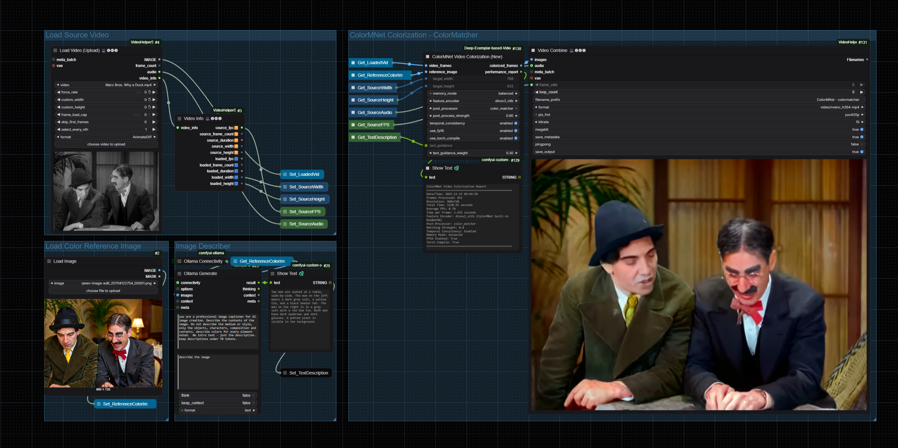

# ComfyUI Reference-Based Video Colorization

<p align="center">
  
</p>

A comprehensive ComfyUI implementation featuring **two state-of-the-art** reference-based video colorization methods:

- **🎨 ColorMNet (2024)** - Modern memory-based approach with DINOv2 features
- **🎬 Deep Exemplar (2019)** - Classic CVPR method with temporal propagation

Transform black & white videos and images into vibrant color using reference images!

---

## ✨ Features

### ColorMNet Nodes (New)
- **ColorMNet Video Colorization** - Memory-based temporal coherent colorization
- **ColorMNet Image Colorization** - Single image colorization
- DINOv2-based feature extraction for superior quality
- Multiple memory modes (balanced, low memory, high quality)
- FP16 support for faster processing
- **torch.compile optimization** for 15-25% speedup (PyTorch 2.0+)
- **Performance reports** with timing and FPS metrics

### Deep Exemplar Nodes (Original)
- **Deep Exemplar Video Colorization** - Frame propagation for temporal consistency
- **Deep Exemplar Image Colorization** - Classic exemplar-based method
- WLS (Weighted Least Squares) filtering for smoother results
- Configurable lambda and sigma parameters
- **torch.compile optimization** for 15-25% speedup (PyTorch 2.0+)
- **SageAttention** for 20-30% faster attention operations
- **Performance reports** for benchmarking

### Common Features
- ✅ **Automatic model download** - No manual setup required!
- ✅ **Progress bars** - Real-time processing feedback in ComfyUI
- ✅ **Performance metrics** - Compare speed and quality between methods
- ✅ **Flexible resolution** - Process at any resolution
- ✅ **ComfyUI native** - Fully integrated workflow support

---

## 📦 Installation

### Method 1: ComfyUI Manager (Recommended)

1. Install [ComfyUI Manager](https://github.com/ltdrdata/ComfyUI-Manager)
2. Open ComfyUI → Manager → Install Custom Nodes
3. Search for "Deep Exemplar Video Colorization"
4. Click Install
5. Restart ComfyUI

Models will download automatically on first use (~700MB total).

### Method 2: Manual Installation

```bash
cd ComfyUI/custom_nodes/
git clone https://github.com/jonstreeter/ComfyUI-Reference-Based-Video-Colorization.git
cd ComfyUI-Reference-Based-Video-Colorization/
pip install -r requirements.txt
```

Restart ComfyUI. Models download automatically on first use.

---

## 🚀 Quick Start

### Example Workflow

Load the example workflow from `workflows/Colorize Video Workflow.json`:

1. **Load Video** - Use VHS Video Loader to load your grayscale video
2. **Load Reference** - Load a color reference image
3. **Choose Method** - Try both ColorMNet and Deep Exemplar
4. **Compare Results** - Use the performance reports to benchmark
5. **Save Output** - Export colorized video with VHS Video Combine

### Nodes Overview

#### ColorMNet Nodes

**ColorMNet Video** (`ColorMNet/Video`)
- `video_frames` - Input grayscale video frames
- `reference_image` - Color reference image
- `target_width/height` - Output resolution
- `memory_mode` - balanced | low_memory | high_quality
- `use_fp16` - Enable FP16 for speed (default: True)
- `use_torch_compile` - Enable PyTorch 2.0+ compilation (default: False)
- **Outputs**: colorized_frames, performance_report

**ColorMNet Image** (`ColorMNet/Image`)
- `image` - Input grayscale image
- `reference_image` - Color reference image
- `target_width/height` - Output resolution
- `use_fp16` - Enable FP16 (default: True)
- `use_torch_compile` - Enable PyTorch 2.0+ compilation (default: False)
- **Outputs**: colorized_image, performance_report

#### Deep Exemplar Nodes

**Deep Exemplar Video** (`DeepExemplar/Video`)
- `video_frames` - Input grayscale video frames
- `reference_image` - Color reference image
- `target_width/height` - Output resolution
- `frame_propagate` - Use temporal consistency (default: True)
- `use_half_resolution` - Process at half resolution (default: True)
- `wls_filter_on` - Apply smoothing filter (default: True)
- `lambda_value` - Filter smoothing strength (default: 500.0)
- `sigma_color` - Color sensitivity (default: 4.0)
- `use_torch_compile` - Enable PyTorch 2.0+ compilation (default: False)
- `use_sage_attention` - Enable SageAttention optimization (default: False)
- **Outputs**: colorized_frames, performance_report

**Deep Exemplar Image** (`DeepExemplar/Image`)
- `image_to_colorize` - Input grayscale image
- `reference_image` - Color reference image
- `target_width/height` - Output resolution
- `wls_filter_on` - Apply smoothing filter (default: True)
- `lambda_value` - Filter smoothing strength (default: 500.0)
- `sigma_color` - Color sensitivity (default: 4.0)
- `use_torch_compile` - Enable PyTorch 2.0+ compilation (default: False)
- `use_sage_attention` - Enable SageAttention optimization (default: False)
- **Outputs**: colorized_image, performance_report

---

## 📊 Performance Reports

All nodes output optional performance reports with timing metrics:

### Example ColorMNet Video Report
```
ColorMNet Video Colorization Report
==================================================
Frames Processed: 240
Resolution: 768x432
Total Time: 45.23 seconds
Average FPS: 5.31
Time per Frame: 0.188 seconds
Memory Mode: balanced
FP16 Enabled: True
Torch Compile: False
==================================================
```

### Example Deep Exemplar Video Report
```
Deep Exemplar Video Colorization Report
==================================================
Frames Processed: 240
Resolution: 768x432
Total Time: 52.34 seconds
Average FPS: 4.59
Time per Frame: 0.218 seconds
Frame Propagation: Enabled
Half Resolution: Enabled
WLS Filter: Enabled
Lambda: 500.0
Sigma Color: 4.0
Torch Compile: False
SageAttention: False
==================================================
```

Connect the performance_report output to a text display node or save to file for benchmarking!

---

## 💡 Tips & Best Practices

### Reference Image Selection
- Choose references **semantically similar** to your content
- Match the **color palette** you want to achieve
- Higher quality references = better results
- Try multiple references to find the best match

### Resolution Settings
- **ColorMNet**: Processes at full target resolution
- **Deep Exemplar**: Internally uses half resolution by default
- Start with 768x432 for good speed/quality balance
- Increase for final high-quality renders

### Memory Management

**ColorMNet Memory Modes:**
- `balanced` - Good quality, moderate memory (recommended)
- `low_memory` - Reduced memory usage, slight quality trade-off
- `high_quality` - Best quality, higher memory requirements

**Deep Exemplar:**
- Enable `use_half_resolution` to reduce memory
- Disable `frame_propagate` for independent frame processing
- Process shorter clips if encountering OOM errors

### Quality vs Speed

**For Best Quality:**
- ColorMNet: `memory_mode=high_quality`, `use_fp16=False`, `use_torch_compile=False`
- Deep Exemplar: `use_half_resolution=False`, `wls_filter_on=True`, `use_torch_compile=False`, `use_sage_attention=False`

**For Best Speed:**
- ColorMNet: `memory_mode=low_memory`, `use_fp16=True`, `use_torch_compile=True`
- Deep Exemplar: `use_half_resolution=True`, `wls_filter_on=False`, `use_torch_compile=True`, `use_sage_attention=True`

**Optimization Notes:**
- `torch.compile` requires PyTorch 2.0+ and provides 15-25% speedup after initial warmup
- `use_sage_attention` (Deep Exemplar only) provides 20-30% faster attention with `sageattention` installed
- Both optimizations maintain identical quality to non-optimized versions

### WLS Filter (Deep Exemplar Only)

The WLS (Weighted Least Squares) filter smooths colors while preserving edges:
- Requires `opencv-contrib-python` to be installed
- `lambda_value` controls smoothing strength (higher = more smooth)
- `sigma_color` controls color sensitivity
- Adds processing time but improves visual quality

---

## 🔧 Advanced Configuration

### Custom Model Paths

Models are automatically downloaded to:
```
custom_nodes/ComfyUI-Reference-Based-Video-Colorization/
├── checkpoints/
│   ├── DINOv2FeatureV6_LocalAtten_s2_154000.pth  # ColorMNet (~500MB)
│   └── video_moredata_l1/
│       ├── nonlocal_net_iter_76000.pth            # Deep Exemplar
│       └── colornet_iter_76000.pth                # Deep Exemplar
└── data/
    ├── vgg19_conv.pth                              # Shared VGG19
    └── vgg19_gray.pth                              # Deep Exemplar VGG
```

### Optimizations

**torch.compile (PyTorch 2.0+):**
Provides 15-25% speedup through graph compilation and optimization.

- Available for all 4 nodes (ColorMNet + Deep Exemplar)
- Enable via `use_torch_compile=True` parameter
- First run includes warmup compilation (slower), subsequent runs benefit from speedup
- No additional installation required if using PyTorch 2.0+

**SageAttention (Deep Exemplar only):**
INT8-quantized attention for 20-30% faster attention operations.

Installation:
```bash
pip install sageattention
```

Requirements:
- CUDA-capable GPU
- PyTorch with CUDA support
- Enable via `use_sage_attention=True` parameter
- Automatically falls back to standard attention if unavailable

**CUDA Correlation Sampler (Optional for ColorMNet):**
ColorMNet can use optimized CUDA correlation operations if available.

Requirements:
- CUDA Toolkit installed
- Visual Studio Build Tools (Windows)
- Will be attempted automatically on first run

**OpenCV Contrib (Required for WLS):**
```bash
pip install opencv-contrib-python
```

---

## 📚 Documentation

- **[Architecture](ARCHITECTURE.md)** - Technical implementation details
- **[Performance](PERFORMANCE.md)** - Benchmarks and optimization guide
- **[Quick Start](QUICKSTART.md)** - Detailed getting started guide
- **[Migration Guide](MIGRATION_GUIDE.md)** - Upgrading from older versions

---

## 🎓 Citation

If you use these methods in your research, please cite the original papers:

### ColorMNet
```bibtex
@article{yang2024colormnet,
  title={ColorMNet: A Memory-based Deep Spatial-Temporal Feature Propagation Network for Video Colorization},
  author={Yang, Yixin and Zhou, Xiaoyu and Liu, Chao and Chen, Junchi and Wang, Zhiwen},
  journal={arXiv preprint arXiv:2404.06251},
  year={2024}
}
```

### Deep Exemplar
```bibtex
@inproceedings{zhang2019deep,
  title={Deep exemplar-based video colorization},
  author={Zhang, Bo and He, Mingming and Liao, Jing and Sander, Pedro V and Yuan, Lu and Bermak, Amine and Chen, Dong},
  booktitle={Proceedings of the IEEE Conference on Computer Vision and Pattern Recognition},
  pages={8052--8061},
  year={2019}
}
```

---

## 🔗 Related Projects

- **Original ColorMNet**: [https://github.com/yyang181/colormnet](https://github.com/yyang181/colormnet)
- **Original Deep Exemplar**: [https://github.com/zhangmozhe/Deep-Exemplar-based-Video-Colorization](https://github.com/zhangmozhe/Deep-Exemplar-based-Video-Colorization)
- **ComfyUI**: [https://github.com/comfyanonymous/ComfyUI](https://github.com/comfyanonymous/ComfyUI)
- **Bringing Old Photos Back to Life**: [https://github.com/microsoft/Bringing-Old-Photos-Back-to-Life](https://github.com/microsoft/Bringing-Old-Photos-Back-to-Life)

---

## 📝 License

This ComfyUI implementation is licensed under the MIT License.

**Note on Model Licenses:**
- ColorMNet model: CC BY-NC-SA 4.0 (Non-commercial use only)
- Deep Exemplar model: Subject to original project license

---

## 🙏 Acknowledgments

- ColorMNet implementation based on [yyang181/colormnet](https://github.com/yyang181/colormnet)
- Deep Exemplar implementation based on [zhangmozhe/Deep-Exemplar-based-Video-Colorization](https://github.com/zhangmozhe/Deep-Exemplar-based-Video-Colorization)
- Thanks to the ComfyUI community for feedback and testing

---

## 🐛 Issues & Support

Found a bug or have a feature request? Please open an issue on GitHub!

For general questions:
1. Check the [documentation](QUICKSTART.md)
2. Review [existing issues](https://github.com/jonstreeter/ComfyUI-Reference-Based-Video-Colorization/issues)
3. Open a new issue with details

---

## 🎯 Roadmap

- [ ] Batch processing optimization
- [ ] Memory-efficient streaming for long videos
- [ ] Additional colorization methods
- [ ] Color transfer utilities
- [ ] Integration with other ComfyUI nodes

---

**Star ⭐ this repo if you find it useful!**
